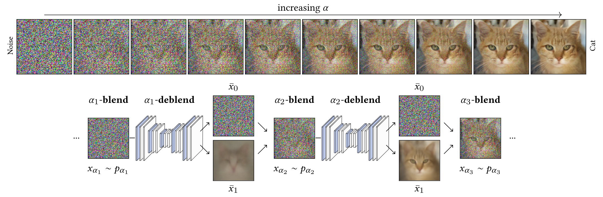

# Iterative α-(de)Blending: a Minimalist Deterministic Diffusion Model
### [Project page](http://todo) | [Paper](http://todo)
<br />

This repository is the official implementation of IADB ([Iterative α-(de)Blending: a Minimalist Deterministic Diffusion Model](https://arxiv.org/abs/2305.03486)), published at Siggraph 2023.




For additional information and explanations, please visit the [project page](http://todo).


# Quick start

If you want to setup a new conda environment, download a dataset (celeba) and launch a training, you can follow this:

```
conda env create -f environment.yml
conda activate iadb
python iadb.py
```

# Setup

Python 3 dependencies:
- [Pytorch](https://pytorch.org/) 
- [torchvision](https://pytorch.org/) 
- [Diffusers](https://github.com/huggingface/diffusers)

This code has been tested with Python 3.8 on Ubuntu 22.04. We recommend setting up a dedicated Conda environment using Python 3.8 and Pytorch 2.0.1.

# Code description

The iadb.py contains a simple training loop.

It demonstrates how to train a new IADB model and how to generate results (using the provided sampleIADB function).

# Citation

TODO